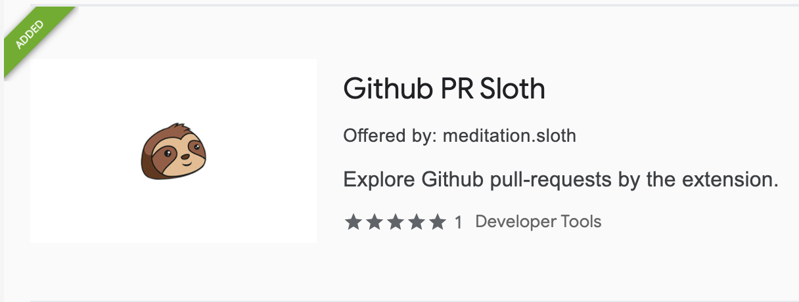

# Pull request sloth

---

It is the browser extension to explore your Github pull-request more efficiently. If you install this extension, managing pull-requests is more efficient, and checking review much more comfortable.

## Get started.

1. Move to web store and install it:

- [Chrome](https://chrome.google.com/webstore/detail/github-pr-sloth/onacocikpankmlhfmflpaeeholbhflbh)

2. Generate Github token:
Move to Settings > Developer settings > [Personal access tokens](https://github.com/settings/tokens/new) in Github, and generate a new token with the `repo` permission.

3. Sign-in with the Github token.

## License

[MIT License](./docs/LICENSE)

## Changelog

